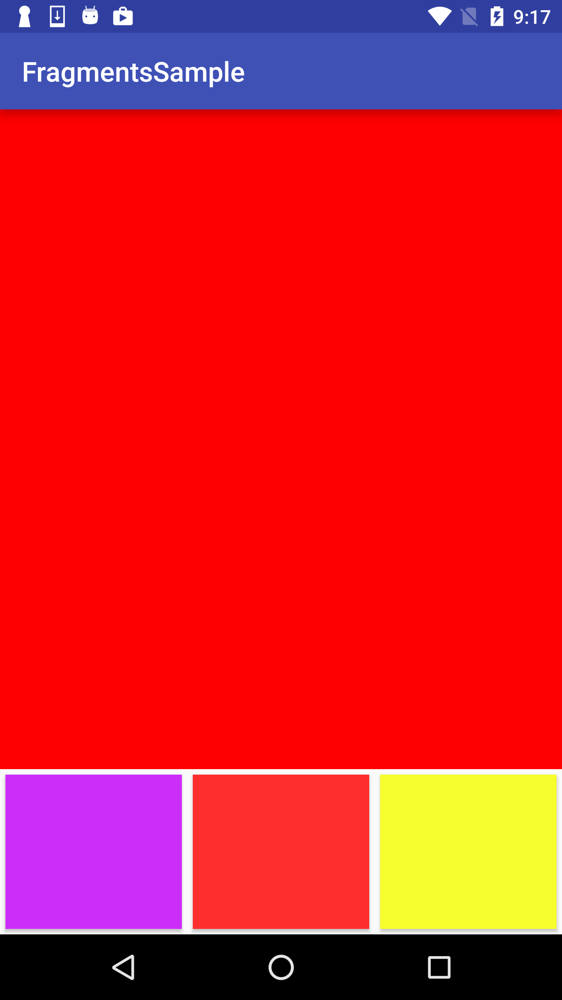
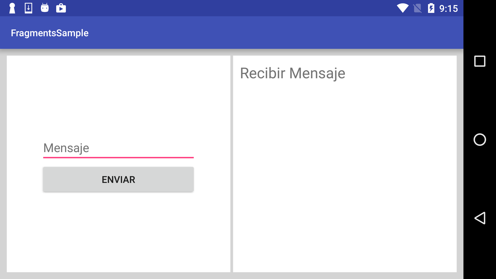
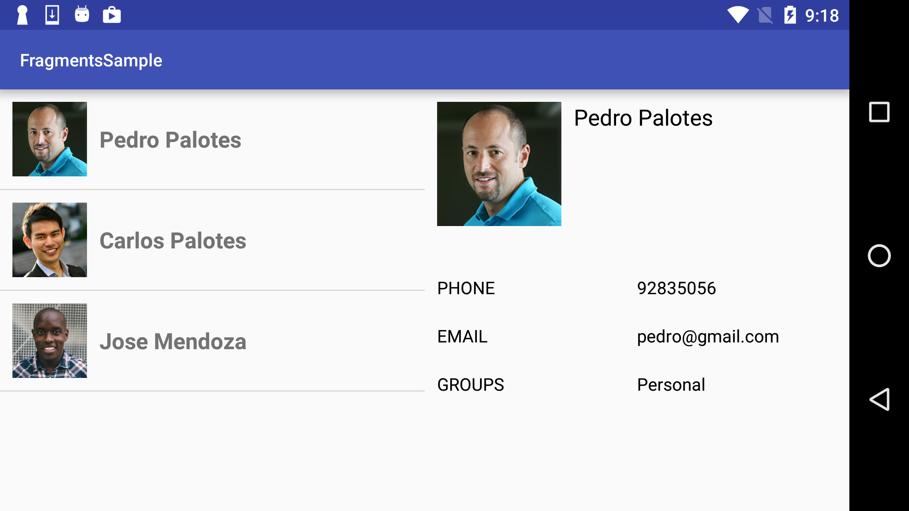
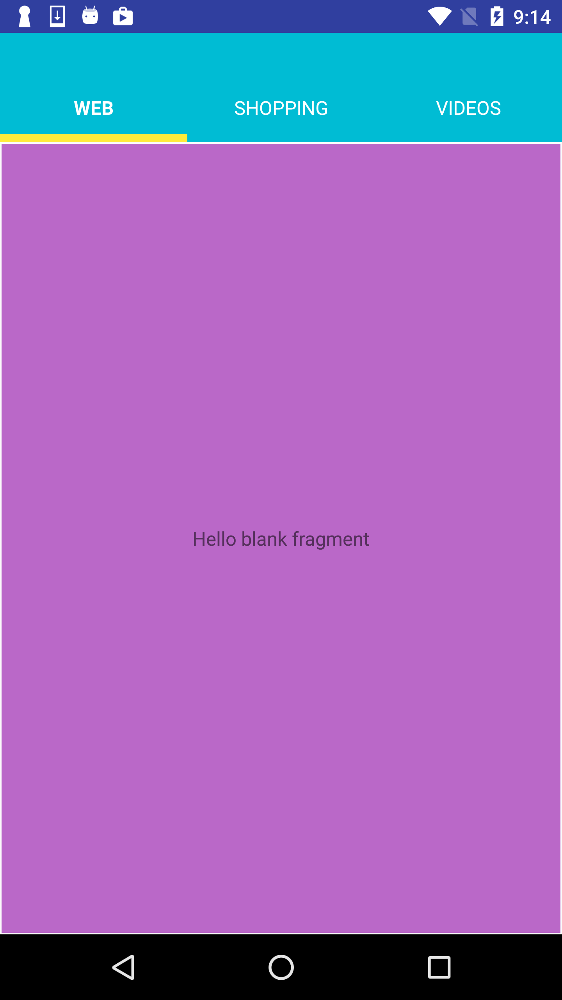
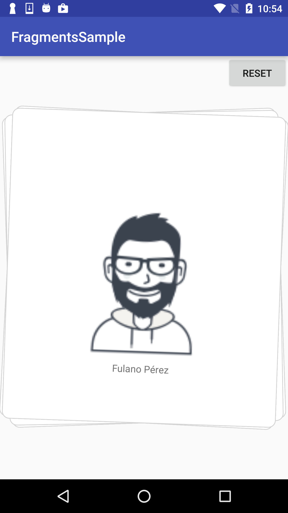

# Android-Fundamentals-GMD
Android Fundamentals (23h)

### Lesson 6 : Fragments(4h)

## Temas :

- Fragments

- Comunicación entre componentes

- Ejercicios

## 1. Fragments

## 2. Comunicación entre componentes

## 3. Ejercicios

### Ejemplos sobre fragments donde trataremos los siguientes puntos :

  * Agregar Fragments mediante XML
     
  * Agregar y remover Fragments dinámicamente
     
  * Comunicación entre Fragments 
     
### Ejemplos 

- Ejemplo 1

- Ejemplo 2

- Ejemplo 3 

En este ejemplo vamos a tener 2 vistas en una pantalla, donde el primero  es fragment con un listado de contactos y el segundo otro fragment con una vista de detalle.

- Ejemplo 4

En este ejemplo vamos a simular la navegación mediante tabs usando fragments

- Ejemplo 5

En este ejemplo vamos a agregar y remover fragments dinámicamente.

 
## Referencias :

- Dynamic UI with Fragments [https://developer.android.com/training/basics/fragments/index.html](https://developer.android.com/training/basics/fragments/index.html)

- Fragmens [https://developer.android.com/guide/components/fragments.html](https://developer.android.com/guide/components/fragments.html)
