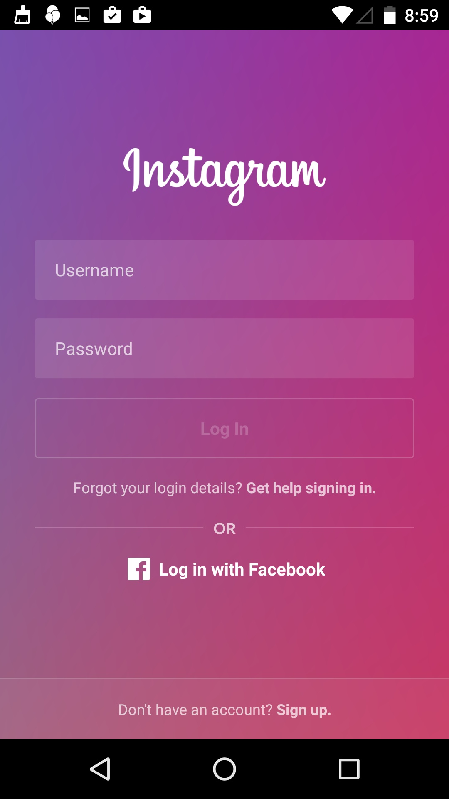
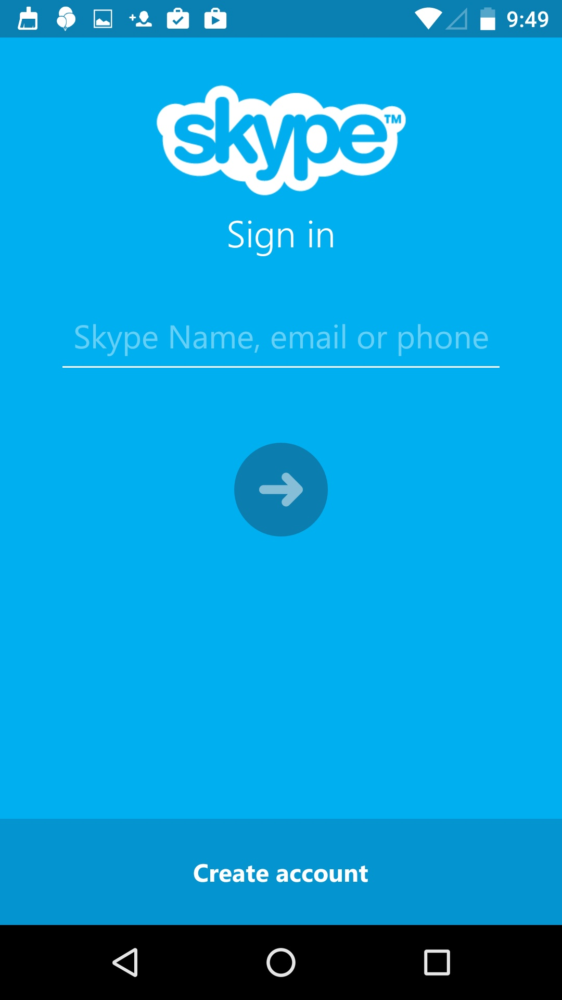

# Android-Fundamentals-GMD
Android Fundamentals (23h)

### Lesson 5 : Eventos de Usuario (3h)

## Temas :

- Eventos de Click

- Eventos de Selección

- Eventos de teclado

## 1. Eventos de Click

Lo primero es instanciar en variables los elementos de la UI a los cuales le agregaremos el evento de click

```java
  private void ui() {
        btn= (Button)findViewById(R.id.btn);
        ivi= (ImageView) findViewById(R.id.ivi);
        flay= (FrameLayout) findViewById(R.id.flay);
        tvi= (TextView) findViewById(R.id.tvi);

        btn.setOnClickListener(this);
        ivi.setOnClickListener(this);
        flay.setOnClickListener(this);
        tvi.setOnClickListener(this);

    }
```

Nuestra vista (actividad) debe   implementar la interface "OnClickListener"
```java
public class BasicEventsActivity extends Activity implements View.OnClickListener{
```

En el método "onClick" es donde recibimos las acciones del evento

```java
    @Override
    public void onClick(View v) {

        String message= null;
        switch (v.getId()){
            case R.id.btn:
                    message= "BUTTON";
                break;
            case R.id.ivi:
                    message= "IMAGEVIEW";
                break;
            case R.id.flay:
                    message= "FRAMELAYOUT";
                break;
            case R.id.tvi:
                    message= "TEXTVIEW";
                break;
        }

        if(message!=null)
            showMessage(message);
    }

    private void showMessage(String message) {
        Toast.makeText(this,message,Toast.LENGTH_SHORT).show();
    }
```

## 2. Eventos de Selección

```java
    private void ui() {
        spLocation =(Spinner)findViewById(R.id.spLocation);


        spLocation.setOnItemSelectedListener(new AdapterView.OnItemSelectedListener() {
            @Override
            public void onItemSelected(AdapterView<?> adapterView, View view, int i, long l) {
                Log.v("CONSOLE", "spLocation" + adapterView.getAdapter().getItem(i));
                localidad = adapterView.getAdapter().getItem(i).toString();
                Toast.makeText(ItemsEventsActivity.this,
                        "Item seleccionado "+localidad,Toast.LENGTH_SHORT).show();
            }

            @Override
            public void onNothingSelected(AdapterView<?> adapterView) {

            }
        });

    }
```

## 3. Eventos de teclado

```java
        //events
        eteUsername.addTextChangedListener(new TextWatcher() {
            @Override
            public void beforeTextChanged(CharSequence s, int start, int count, int after) {
                Log.v("CONSOLE", "beforeTextChanged "+s.toString());
            }

            @Override
            public void onTextChanged(CharSequence s, int start, int before, int count) {
                Log.v("CONSOLE", "onTextChanged "+s.toString());
            }

            @Override
            public void afterTextChanged(Editable s) {
                Log.v("CONSOLE", "afterTextChanged "+s.toString());
            }
        });
```

```java
        etePassword.setOnEditorActionListener(new TextView.OnEditorActionListener() {
            @Override
            public boolean onEditorAction(TextView v, int actionId, KeyEvent event) {
                if(event!=null){
                    Log.v("CONSOLE ","keycode "+event.getKeyCode()+
                    " actionId "+actionId);
                }

                if ((event != null && (event.getKeyCode() == KeyEvent.KEYCODE_ENTER)) || (actionId == EditorInfo.IME_ACTION_DONE)) {
                    send();
                }
                return false;
            }
        });
```
## Ejercicios :

  - Validación de un formulario de autenticación.
  
  
  
  - Navegación y validación de un formulario de registro de usuario .
  
  
  
  
  
  
## Referencias :

- Input Events [https://developer.android.com/guide/topics/ui/ui-events.html?hl=es](https://developer.android.com/guide/topics/ui/ui-events.html?hl=es)

